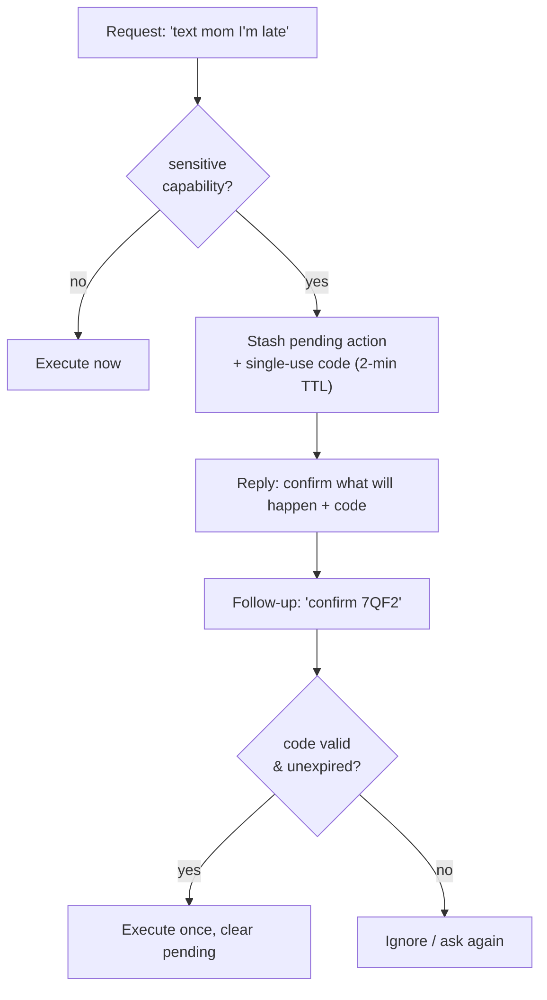
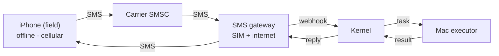

# DESIGN.md — Coo

*Text your Mac home.*

## Goal
Let me ask for things in plain language from anywhere — including when my phone has
no internet — and have my Mac carry them out and reply.

## Plain-English summary
When you're somewhere with a bad connection, your phone often still has enough
signal to send a **text**, because texts ride on an older, tougher part of the phone
network that keeps working when the internet doesn't. This project uses that fact:
you text a request, it reaches your Mac at home, the Mac does the work, and it texts
you back.

The one wrinkle is that a Mac has no phone number, so it can't receive a text by
itself. A small always-on **gateway** at home (an old phone with its own SIM, or a
paid SMS number) catches the text and hands it to the Mac. From there a **kernel**
("the brain") checks it's really you, figures out what you meant, runs the matching
action, and sends the answer back. Crucially, the AI never invents commands — it
picks from a fixed **menu of allowed actions**, which is both safer and more reliable.

## Architecture

*Reachability underneath all of it:* a **Tailscale mesh**. Every device dials out to
the tailnet, so nothing needs an open inbound port and nothing is exposed to the
public internet. Dashed boxes are designed but not built yet.

## The core problem and the channel decision
"Offline" here means **no data but still has cellular signal** — the everyday case,
not true wilderness. That single definition determines the transport:

- **Has signal, data off →** SMS over the carrier network. National range, no
  internet needed on the phone. **This is our channel.**
- No signal at all, modern phone → satellite direct-to-cell texting (not needed
  here, noted for completeness).
- Fully off-grid → LoRa mesh with dedicated radios (out of scope).

Only the phone-to-carrier hop is ever offline; everything past the gateway is
ordinary online plumbing.

## Components

### Channels (ways to ask)
Each channel is a thin adapter that turns the outside world into one internal request
shape and back. Adding a channel never touches the kernel.
- **curl / direct** — works today; used for testing.
- **iPhone Shortcut → HTTP** (next) — a Shortcut does "Get Contents of URL", POSTing
  the query to the Mac's tailnet address. No companion app required.
- **iPhone → SMS → gateway** (later) — the genuinely-offline path. The gateway is
  the sole cellular-to-internet bridge and needs its own SIM/number, distinct from
  the everyday phone.

### Kernel (the brain) — built
Four steps in sequence:
1. **Auth** — confirm the request carries the shared token. (SMS sender IDs are
   spoofable, so identity must live in the message, not the "from" field.)
2. **Intent · LLM** — the capabilities are shown to a language model, which chooses
   exactly one and fills its parameters; it cannot author code. The provider is
   pluggable behind an OpenAI-compatible interface: a **local model (llama.cpp +
   Qwen) is the default**, with Claude and hosted open-weight APIs as drop-in
   alternatives. Reliability comes from **JSON-schema structured output**, which
   constrains the model to emit a valid `{capability, params}` object — so even a
   small local model can't return anything unparseable.
3. **Router** — pick a node that offers the chosen capability and is online. Today
   that's the Mac; the design generalizes to multiple nodes.
4. **Egress** — format the result for the channel it came in on (e.g. trim for SMS).

### State store
- **Registry** — which nodes are online and what each can do.
- **Sessions** — short-term context so follow-ups ("actually, avoid highways") work.
- **Keys** — the shared token and any API keys, kept in the kernel.

### Executors (where it runs)
- **Mac** (built) — the workhorse: `osascript`, shell, and `shortcuts run`, exposed
  as 10 capabilities (open apps, read/set clipboard, send iMessage, control Music,
  get directions, system status, run any Shortcut, speak, open URLs).
- **iPhone** (later) — limited to App Intents / Shortcuts and hard to trigger
  remotely; treated as a *requester* first, an *executor* only if/when needed.

## The capability registry (and why)
The kernel maps intent to a **fixed set of pre-defined, parameterized capabilities**
rather than letting the model generate raw osascript. This is deliberate:
- **Safety** — an inbound message can never run arbitrary code; it can only invoke
  reviewed actions with typed parameters.
- **Reliability** — hand-written, tested scripts beat freshly-generated AppleScript.
- **Extensibility** — one registry entry becomes both an LLM tool and a testable
  structured command automatically.

`run_shortcut` is the deliberate escape hatch: anything buildable in the Shortcuts
app becomes callable without new Python.

## Confirmation flow for sensitive actions
Most capabilities are read-only or harmless (open an app, read the clipboard,
report status) and run immediately. A few *act on the world* — `send_imessage`
sends a message as you; future ones might spend money or delete things. Those are
marked **sensitive** and must never fire from a single message.

**Mechanism.** Each capability carries a `sensitive` flag in the registry. When the
resolver picks a sensitive capability, the kernel does not execute. Instead it:
1. stashes the pending `(capability, params)` in session state under a random,
   single-use **confirmation code** with a short TTL (e.g. 2 minutes), keyed to the
   authenticated sender; and
2. replies with exactly what it's about to do plus the code, e.g.
   `About to iMessage +1555…: "on my way". Reply "confirm 7QF2" to send.`

The follow-up `confirm 7QF2` looks up the pending action, checks it hasn't expired
and belongs to this sender, executes it once, and clears it. A re-sent code does
nothing (single-use), so a duplicated SMS can't double-send.

**Why this shape:** it's one extra text over SMS (cheap), scoped to the same
authenticated sender/session (no one else can confirm your action), the code is
single-use and time-boxed (no replay), and the echo-back means you always see the
exact parameters before anything happens. Reads and opens stay zero-friction; only
the actions that matter pay the one-message tax. This relies on the **Sessions**
part of the state store, which the kernel doesn't yet implement.

**Currently sensitive:** `send_imessage`. Add the flag to any capability that
sends, spends, deletes, or contacts someone.

## Message lifecycle (offline case)

The Mac being online is what lets even web-dependent actions (like directions) work
while the phone is offline: the phone is the *requester*, the online Mac does the web
part on its behalf. Device-local actions (open app, read file, toggle a setting) need
no internet at all past the gateway.

## Reachability
A **Tailscale** mesh gives every device a stable, encrypted address reachable from
anywhere, with devices dialing out (no port forwarding, no public exposure). The Mac
on the tailnet is reachable by SSH and by the kernel's HTTP endpoint. **iCloud /
CloudKit** is a possible future async bus if cross-device state sync is wanted.

## Security invariants
1. The LLM selects capabilities; it never writes or executes code.
2. All values reach `osascript`/shell as `argv`, never string-interpolated; no `shell=True`.
3. Every mutating request is token-authenticated.
4. Bind to localhost; expose only via Tailscale, never a public port-forward.
5. Sensitive/destructive capabilities require an explicit confirmation step (see
   "Confirmation flow for sensitive actions" above) before they execute.

## Status
| Layer | State |
|---|---|
| Kernel loop (auth, intent, router, egress) | Built |
| Mac executor (11 capabilities) | Built |
| Intent provider (local llama.cpp default, pluggable) | Built |
| iPhone Shortcut → HTTP over Tailscale | Built |
| Confirmation flow for sensitive actions | Built |
| Multi-step plans + `{{stepN}}` chaining | Built |
| Request history + dashboard | Built |
| SMS gateway (offline channel) | **Next** |
| iPhone-side execution | Later |

## Decisions locked
- "Offline" = no data but has signal → **SMS** is the long-range channel.
- Intent maps to a **capability registry**, not free-form generated code.
- The **Mac is the executor**; the **iPhone is a requester**.
- Reachability via a **Tailscale mesh**; nothing exposed to the public internet.
- **LLM provider is pluggable, local-by-default.** The intent step runs on a local
  model (llama.cpp + Qwen) via an OpenAI-compatible interface, with Claude and
  hosted open-weight APIs as swap-in alternatives. Rationale: the task is a narrow
  tool-pick, so a small local model suffices, and keeping it local means privacy
  and no per-request cost. (Trade-off: a local model only runs while the Mac is
  awake — see the kernel-location open decision.)

## Open decisions
- **Kernel location.** Currently Mac-hosted (simplest), but unreachable while the
  Mac sleeps. A thin always-on host (home Pi or small VPS) is more robust if the
  phone must reach the system regardless of the Mac's state. This now also governs
  the LLM: a local model shares the Mac's uptime, so an always-on kernel would
  either run its own small model or call a hosted one.
- **iPhone-execution path**, if/when needed: the quick route (Pushcut or the native
  notification-triggered Shortcut automation in the '27 OS cycle) vs. a custom
  App Intents companion app (more work, no third party, Siri for free).